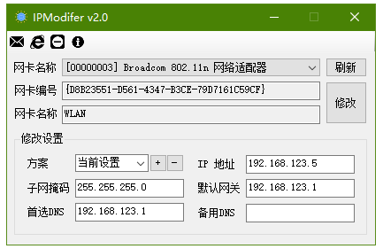
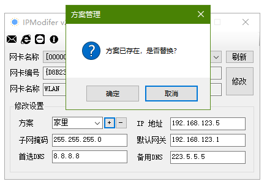

# IPModifer v2
快速切换公司，家里，机房，客户公司等等IP设置；

在路由调试工作中，经常会在不同的客户公司的网络环境中反复修改IP设置。觉得甚是麻烦。写个GUI程序，斩断这烦恼丝！

v2相对于 c0ny1 原版改动详见更新日志。

## 项目结构
```
|---clean.bat 清除垃圾批处理
|---IPModifer.sln 工程文件
|---IPModifer 代码文件夹
|---doc 文档
|    |--- main.png 主界面
|    |--- configmannager.png 配置方案管理界面
```

## 主界面


## 配置方案界面


## 更新日志
**v2.1**
1. 修复[当前设置]方案中，无法获取到*备用DNS*
2. 修复添加新方案后立即删除的错误
3. 界面文案完善
4. 部分操作防呆
  
**v2.0**
1. 改用ini存储配置
2. UI调整，整合在一个页面管理方案
3. 增加[自动获取]方案
4. 精简冗余代码
